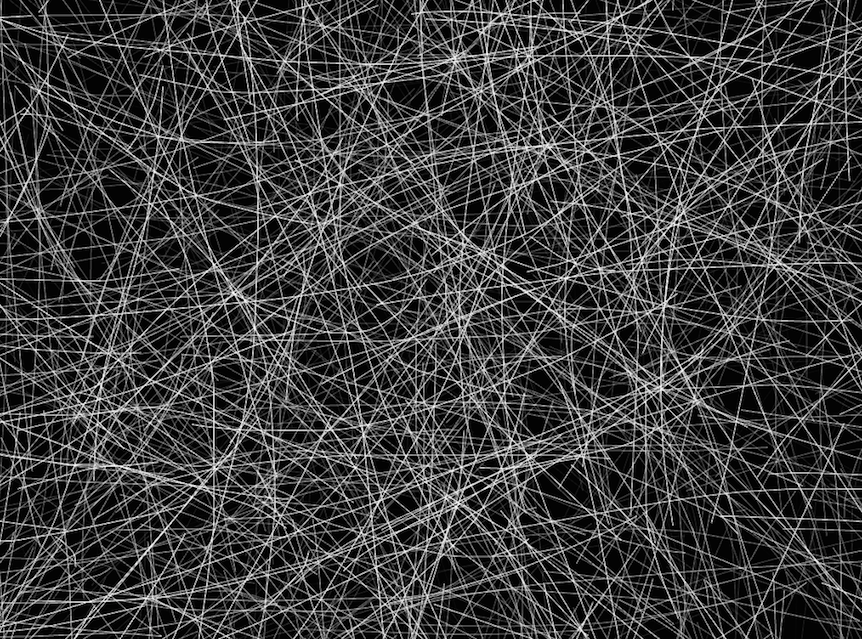

# Final Project: Test 1

NOTE: Press the spacebar to see 3 different scenes. 

This is an experiment to try to simulate mycilium. In particular I wanted to model the web/strand like nature you see at the microscopic level. It became a bit challenging to simulate the node list structure of the webs.

In this first iteration, I produced a system that is based on 3 different behaviors. 

Image of Mycelium:

