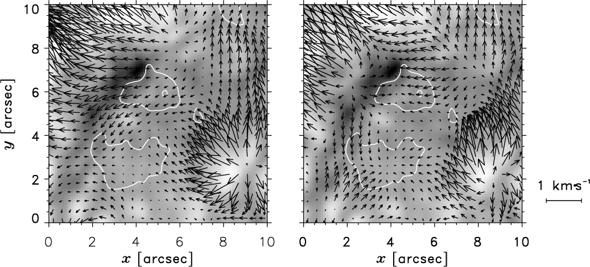
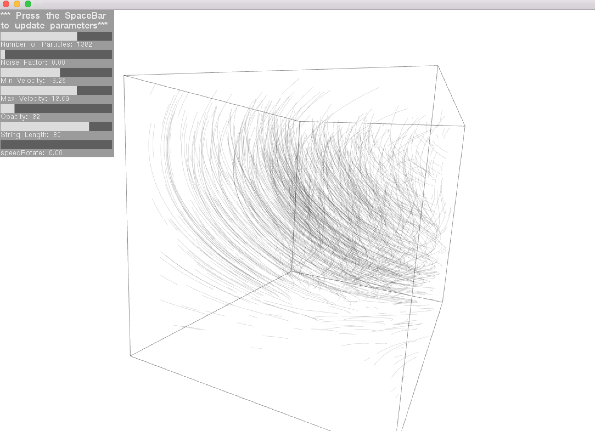
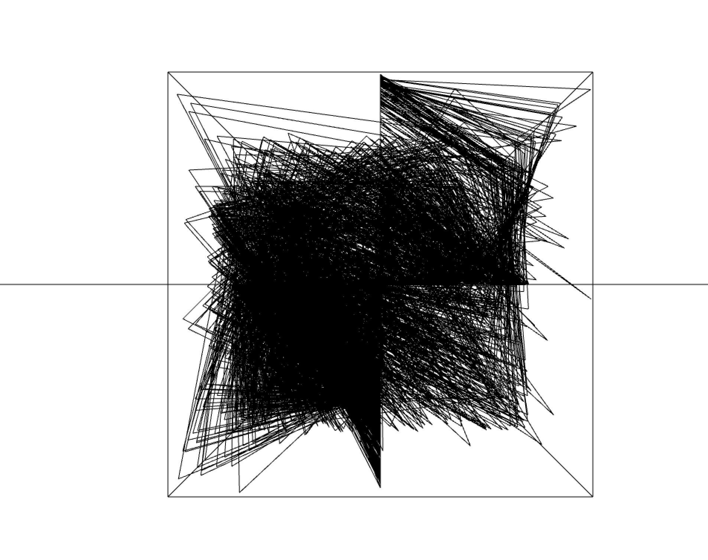

# Final Project: Test 2

This is a second itteration where I started playing with a simulation of vector fields/flow fields. 

Using the ofxUI addon a GUI was made to demonstrate how changing parameters can change the behavior of the system. 

NOTE: Each time you change a parameter in the GUI you have to press spacebar to update the system.

Inspiried by [Frankie Zafe's](http://www.frankiezafe.org/index.php?id=117&tx_ttnews%5Btt_news%5D=261&cHash=e2457a72c7e11c6bcdfceeabc9512c7d) *Harmonic Plants Research*. 

Vector Field Example from Math:

Image of the GUI and beginning testing of the vvector field:

Here is an early example of trying to work out the code. I had to work on special boundary conditions to remove these lines that were occuring each time a particle passed through the boudaries. 

