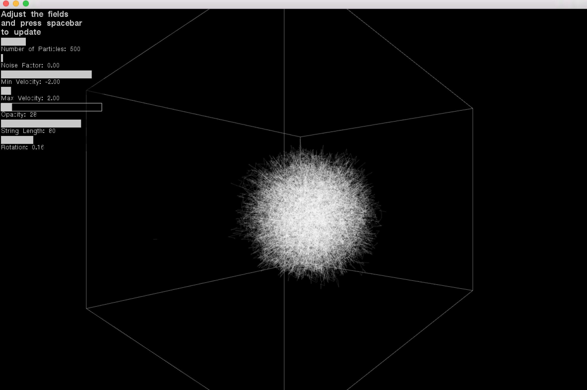
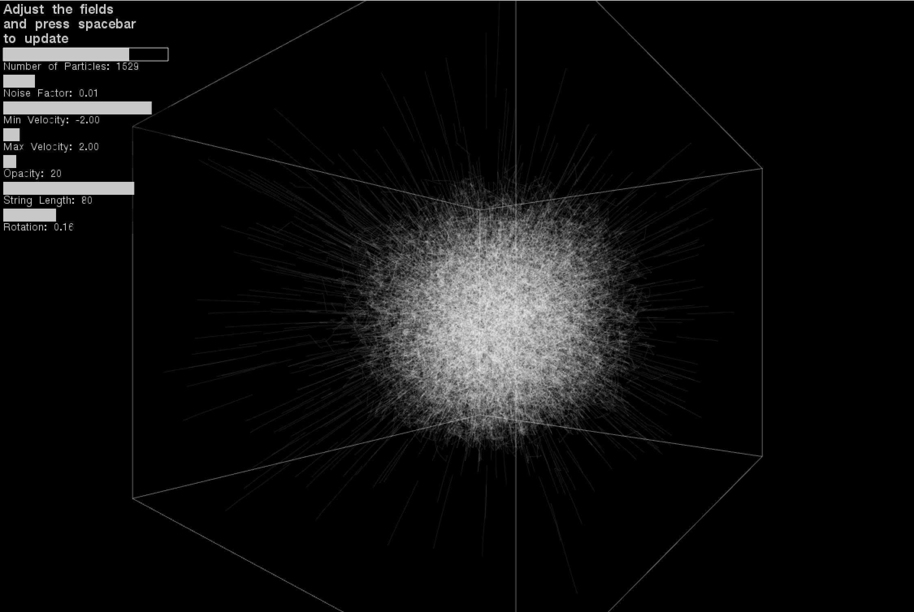

# Final Project: Galactic Cloud

NOTE: Each time you change a parameter in the GUI you have to press spacebar to update the system.

In this example, I wanted to try to use a flocking algorithm inside the 3D box. The flocking did not really work, but what came out instead was a beautiful Galactic Cloud. Generative art has a way of sometimes being unpredictible, but cool none the less. 

Using the ofxUI addon a GUI is made to demonstrate how changing parameters can change the behavior of the system. 

