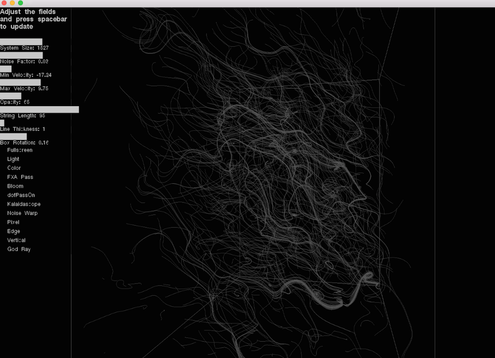
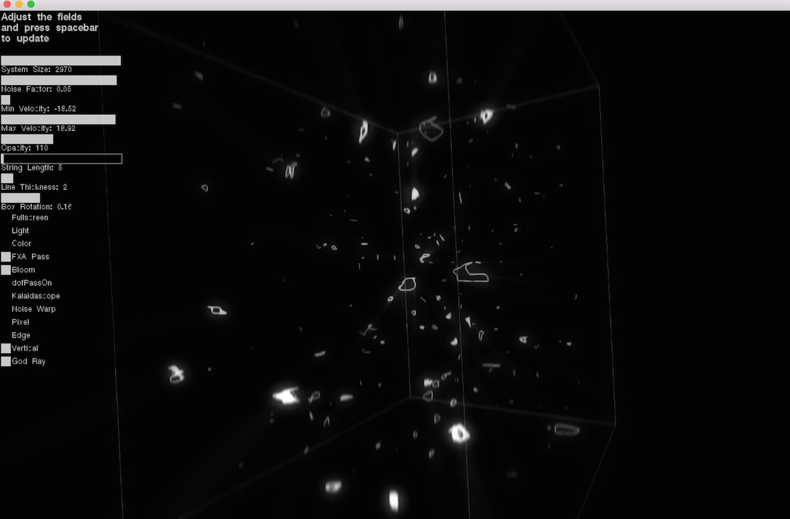
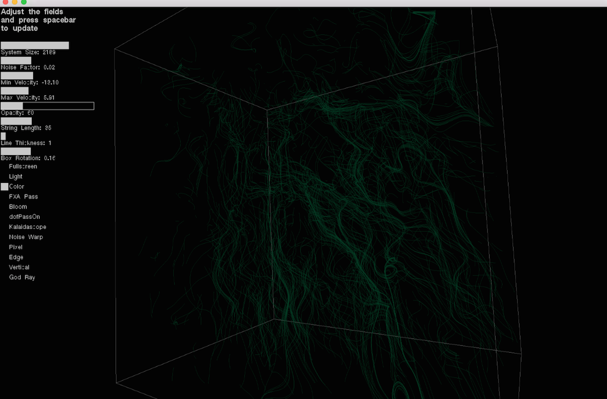
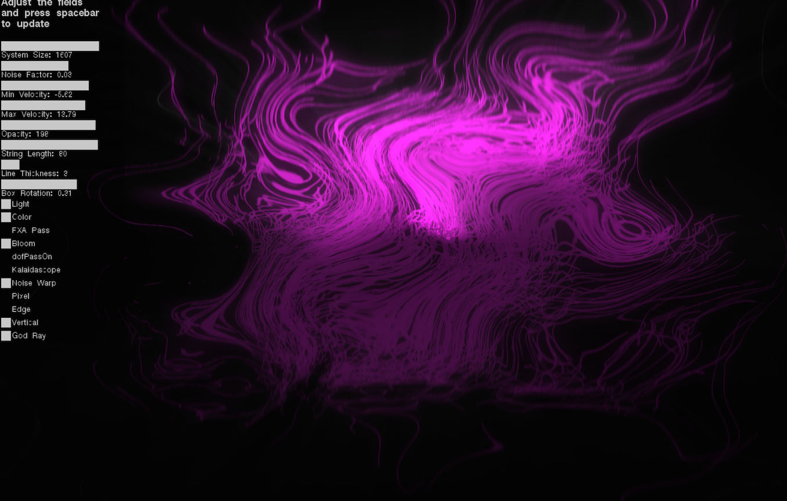
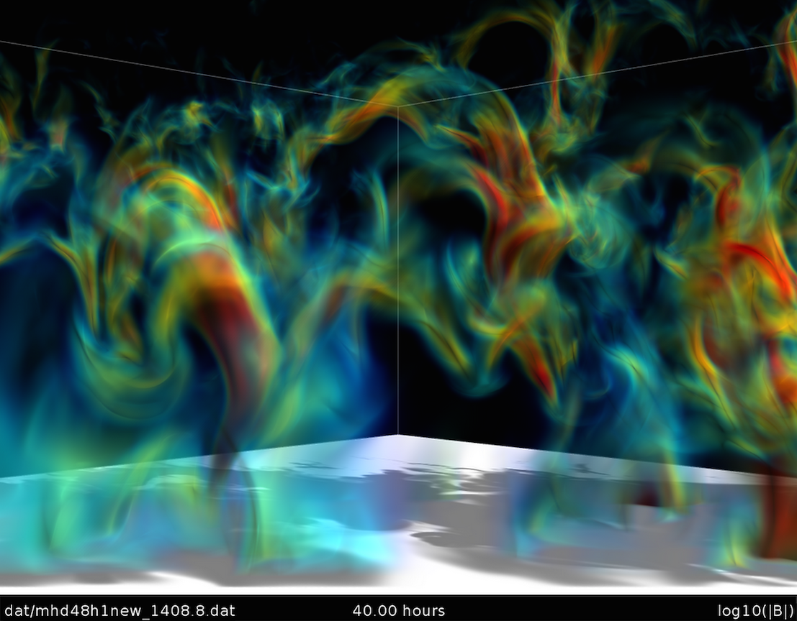
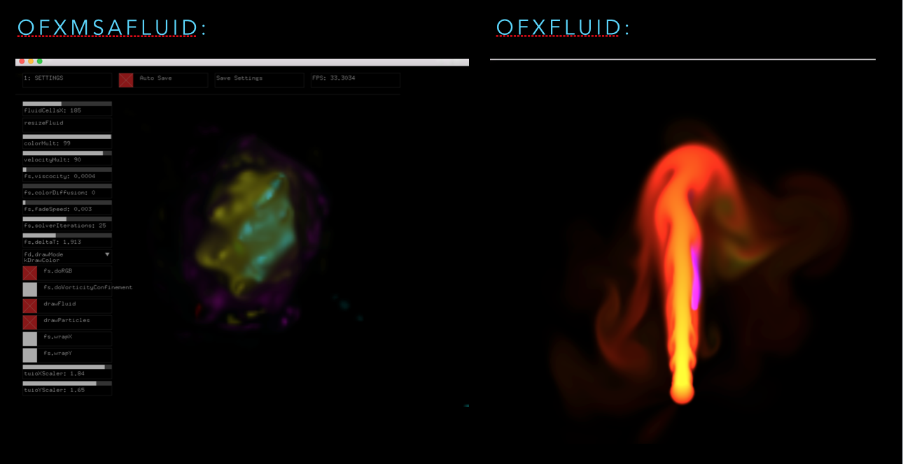
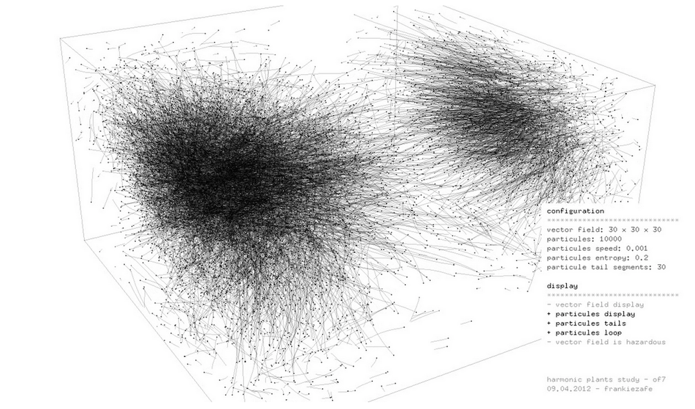
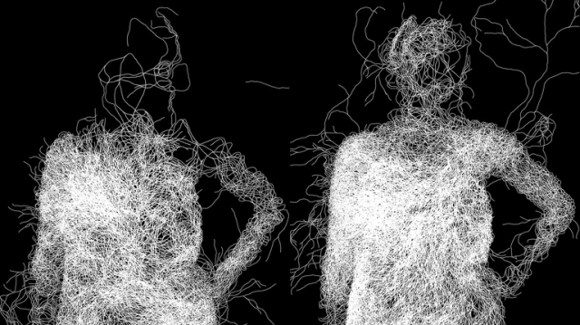

# Final Project
 
## *microMACRO: Creative Coding from Dark Matter to String Theory*

###Project Concept

This project is an exploration in the duality between the micro and the macro — a duality that, while seemingly different, is inherently similar, fractal, reflective and mirrored. Through experiments using the OpenFrameworks platform, I made a series of creative visuals that may prompt us all to reflect on the beauty and unity in the microMARO-cosm.    

###Short film

Click on this link to see the creative coding short film I made for this project:

[VIDEO](https://vimeo.com/113435706)

###Technical Notes

NOTE: Each time you change a parameter in the GUI you have to press spacebar to update the system.

Addons:

1) ofxUI -  GUI is made to demonstrate how changing parameters can change the behavior of the system. 

2) ofxPostProssesing - playing with other visual effects 

###Documentation

Basic string theory image:

Image of different effects:

Use of color:

Using ofxPostProcessing effects:

###Future Iterations

I tried to play with simulations of more fluid like motion. Here is an image from [NASA](http://www.nasa.gov/ames/magnetic-field-loops-on-the-sun/#.VH5hrKTF8m-) of supercomputer simulation of magnetic field loops on the Sun. 

I tried working with two addons (ofxMSAFluid and ofxFluid) only to discover that neither of these support 3D. I hope for future itterations of this project to be able to implament a 3D version of fluid motion and further my research into fluid motion in general. 

###Precedents

Inspiration was taken from the work of:

1) Frankie Zafe's work [Harmonic Plants](http://www.frankiezafe.org/index.php?id=117&tx_ttnews%5Btt_news%5D=261&cHash=e2457a72c7e11c6bcdfceeabc9512c7d).

2) Ryan Alexander's work [Mycilium](http://www.creativeapplications.net/processing/mycelium-processing/).

###Sources & Research

Here are the links to the most interesting sources and research I came across while undergoing this project:

[http://people.sc.fsu.edu/~jburkardt/cpp_src/brownian_motion_simulation/brownian_motion_simulation.html](http://people.sc.fsu.edu/~jburkardt/cpp_src/brownian_motion_simulation/brownian_motion_simulation.html)

[http://www.paulferragut.com/fractional-brownian-motion/](http://www.paulferragut.com/fractional-brownian-motion/)

[http://iquilezles.org/www/articles/warp/warp.htm](http://iquilezles.org/www/articles/warp/warp.htm)

[http://www.memo.tv/ofxmsafluid/](http://www.memo.tv/ofxmsafluid/)

[http://www.ncbi.nlm.nih.gov/pmc/articles/PMC3317364/](http://www.ncbi.nlm.nih.gov/pmc/articles/PMC3317364/)

