florr422_sims2014
=================

_PSAM 5566 - Creative Coding Homework_

_This is the "Read Me" file for the homework repository for Creative Coding taught by Patricio Gonzalez Vivo. [sims2014](https://github.com/patriciogonzalezvivo/sims2014/)_

_Please note that it is in "blog format". Meaning the newest homeworks are found at the top of the document and the oldest homework is found at the bottom of the document._
_____________________________________________

# Homework: Week 07

Beautiful image of combining Barbara's Oscillating Plane with my Shepre:
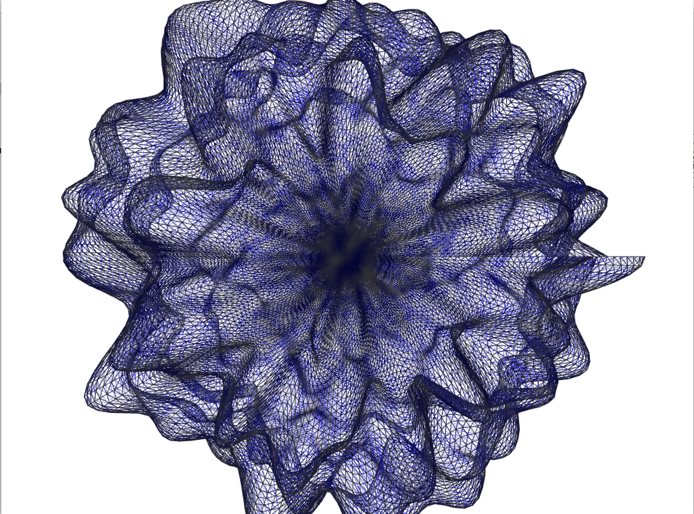

_____________________________________________

# Midterm: Creative Simulations

My Midterm is based on my fascination with the fundamental building blocks of the universe. As a former astrophysicist, my creative interests lie somewhere in the intersection of art and science. I will continue to push this concept of "simulating" the geometries that govern our entire universe.

[Presentation](images/CreativeCodeMidterm.pdf)

Here is a short compilation of the 6 pieces that I made for the midterm:
[Midterm Compilation Video](https://vimeo.com/108428005)

Here is the work of [Reza Syed](http://www.syedrezaali.com/#/a-drifting-up/) who I based a few of these early sketches off of. Reza is an amazing code artist!!! I have long admired his work and can only hope to one day be as talented a coding artist as he is!

_____________________________________________

# Homework: Week 04

## Non-code:

Here are some with all 12:

[Disney's 12 Principles](https://www.youtube.com/watch?v=bHfDEsNLg34)

[All 12 from Burn-E](https://www.youtube.com/watch?v=lLqmf9EVpAw)

[All 12 if you like heavy metal](https://www.youtube.com/watch?v=OKiD0nQVMic)

[Another one of all 12](https://www.youtube.com/watch?v=xqGL1ZLk3n8)

Here are 6 broken Out:

[Anticipation](https://www.youtube.com/watch?v=OydSRRE1rx8&index=6&list=PLEJNsWg7FyAHDT-0Ik9dOuI3dn-guJTY1)

[Staging](https://www.youtube.com/watch?v=V0vKbxY61Es)

[Straight Ahead & Pose to Pose Animation](https://www.youtube.com/watch?v=sZHdfHJtNWc)

[Arcs](https://www.youtube.com/watch?v=YDwufYmVVo8&list=UU5AYxiUvVWB0ORzZDVz6Biw)

[Secondary Motion](https://www.youtube.com/watch?v=MsdoPlL1t38&list=UU5AYxiUvVWB0ORzZDVz6Biw)

[Exageration](https://www.youtube.com/watch?v=3NU-MOpWtm4&list=UU5AYxiUvVWB0ORzZDVz6Biw)

_____________________________________________

# Homework: Week 03

## Non-code:
There are particles everywhere. In fact, everything is made up of particles. We are all part of the cosmic soup that was created after the Big Bang. Cosmic Dust is everywhere. Here is a video I made of "cosmis dust" created by a falling brick wall in NYC.  [Particles Short](https://vimeo.com/106728861)

## Code:
(a)
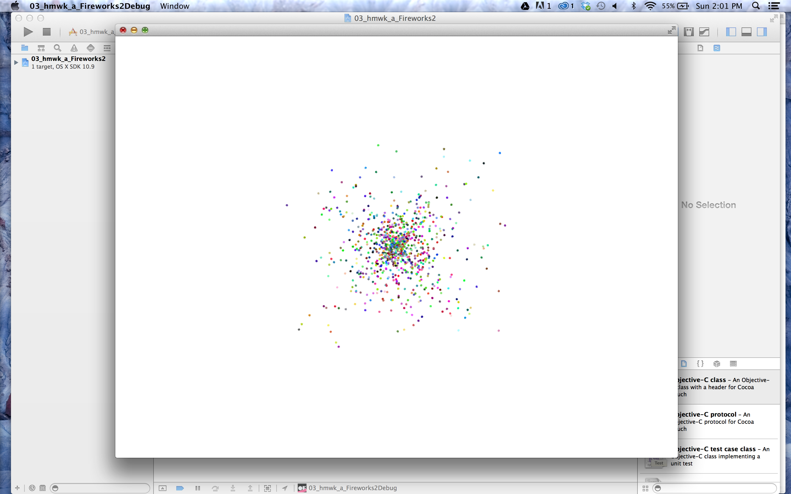

(b)
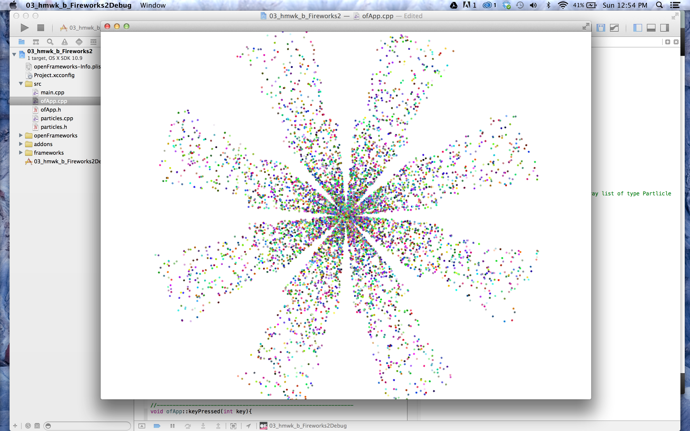

(c)
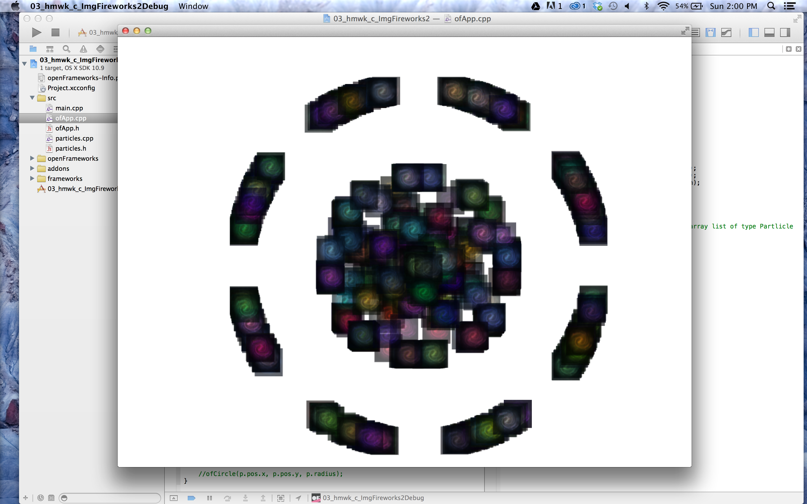

_____________________________________________

# Homework: Week 02

## Non-code:

Mathematics is everywhere in nature. Here are three videos that of observations I made of motion, i.e. mathematics coming to life.

[Pendulum Motion - Golf Swing](https://vimeo.com/106741996)

[Wave Motion - Ocean Waves](https://vimeo.com/106741997)
	

## Code:

(a)
Here is a trail sketch (no clear screen):
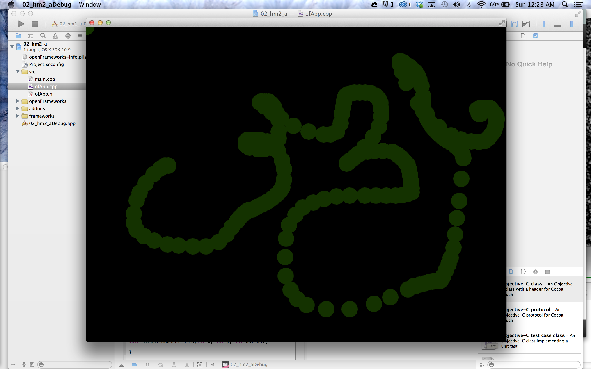
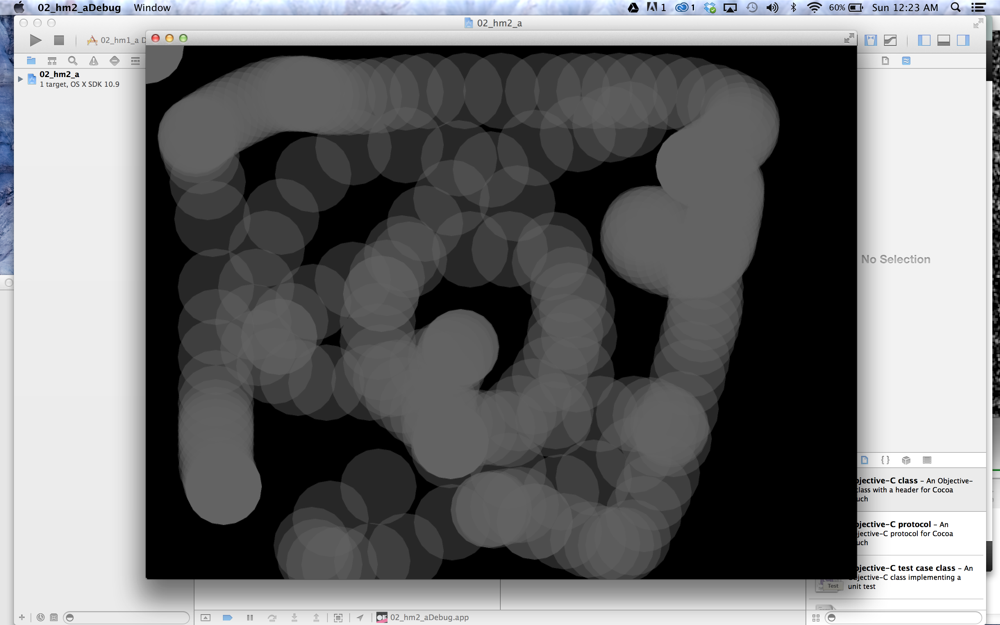

(b)
Here are the images I used as the imspirations of the natural phenomenon:

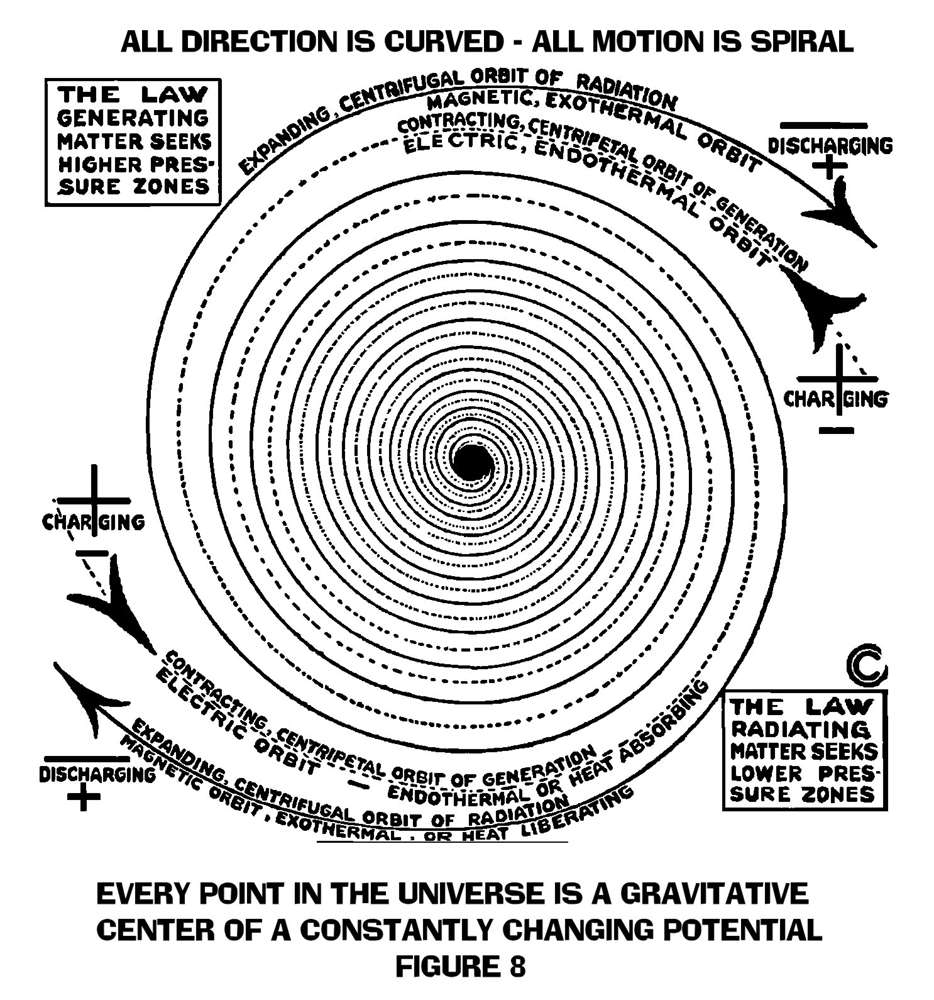

Here are the screen shots of the spirals that I created:
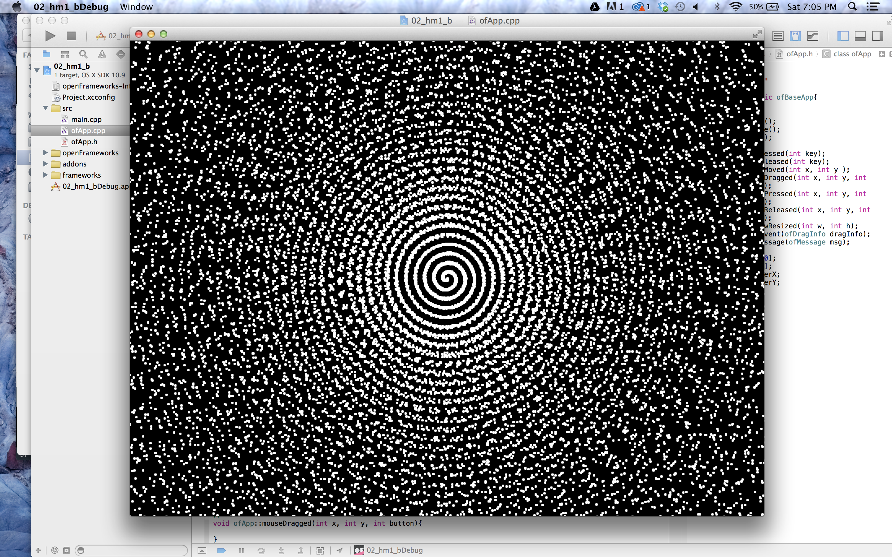
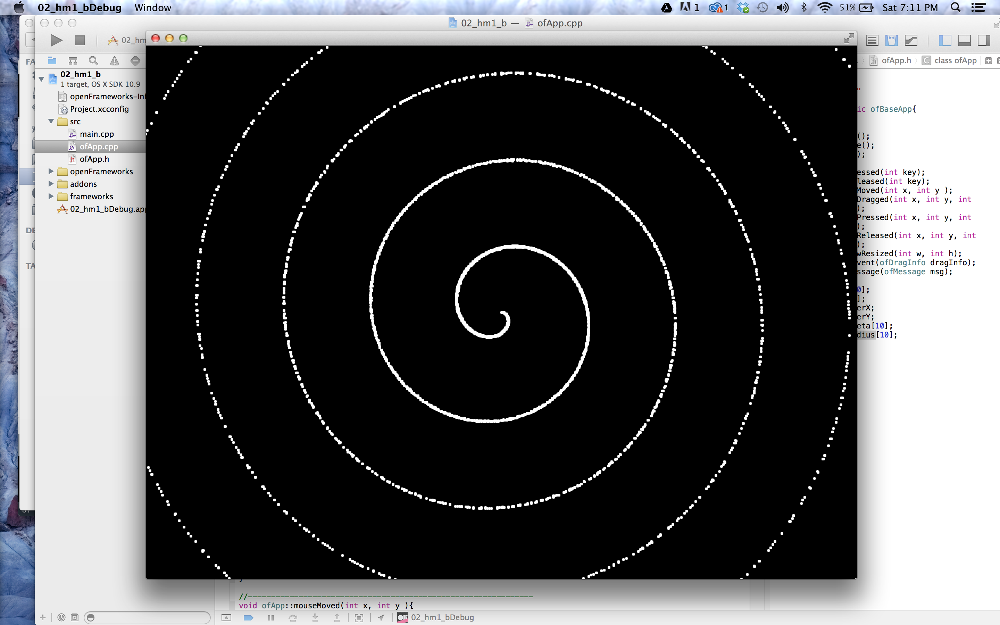

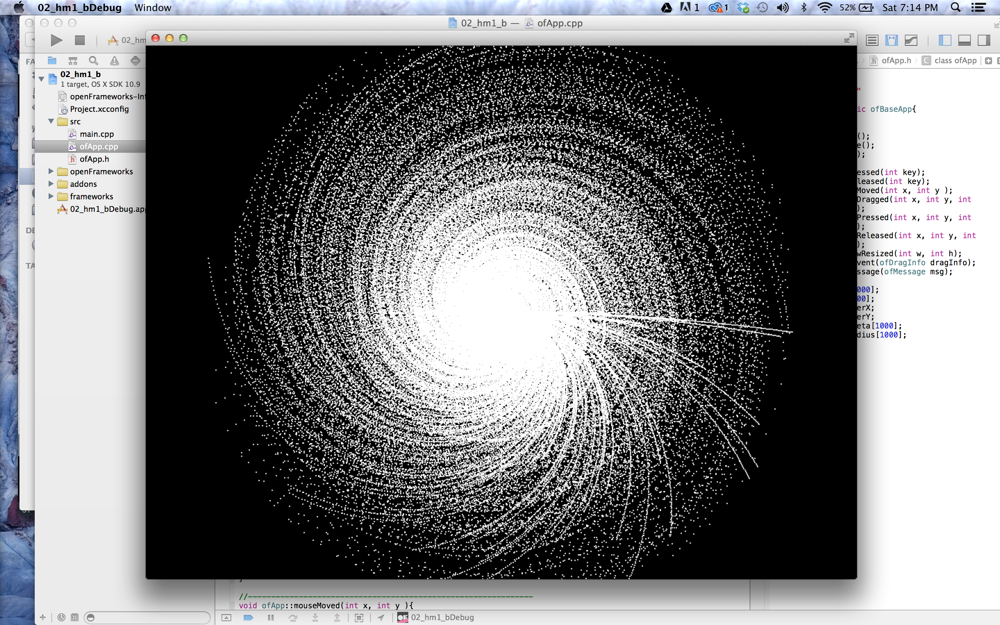
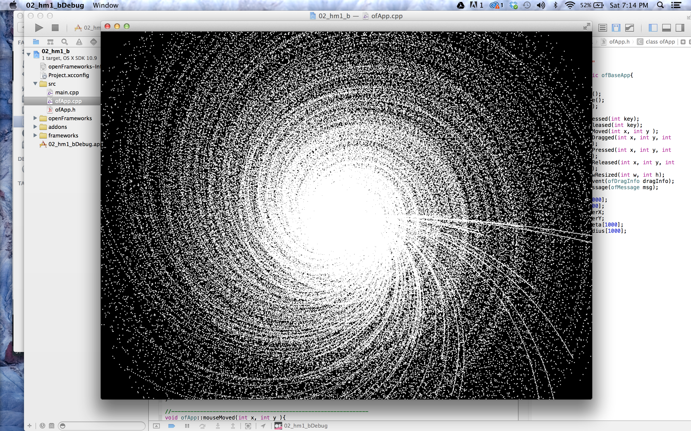
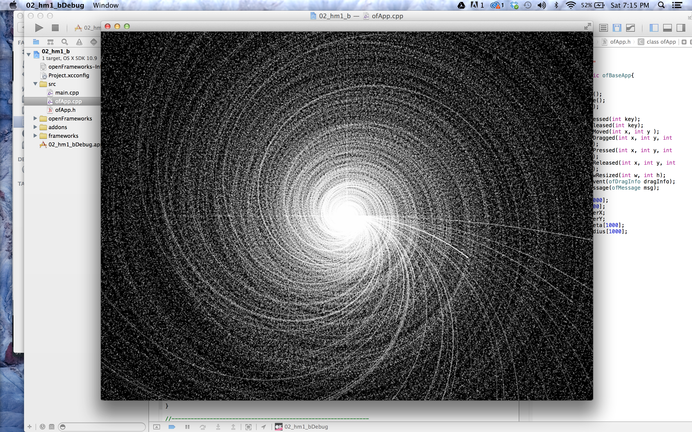

_____________________________________________
# Homework: Week 01

## Non-code:

Image of the flip book I made (note I used a sewing machine for the binding of this book):
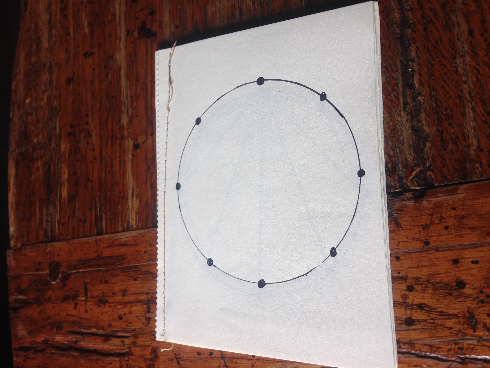
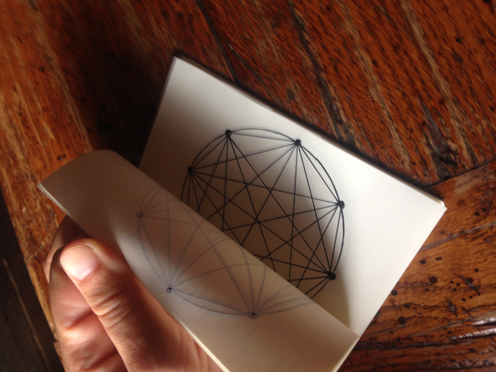

